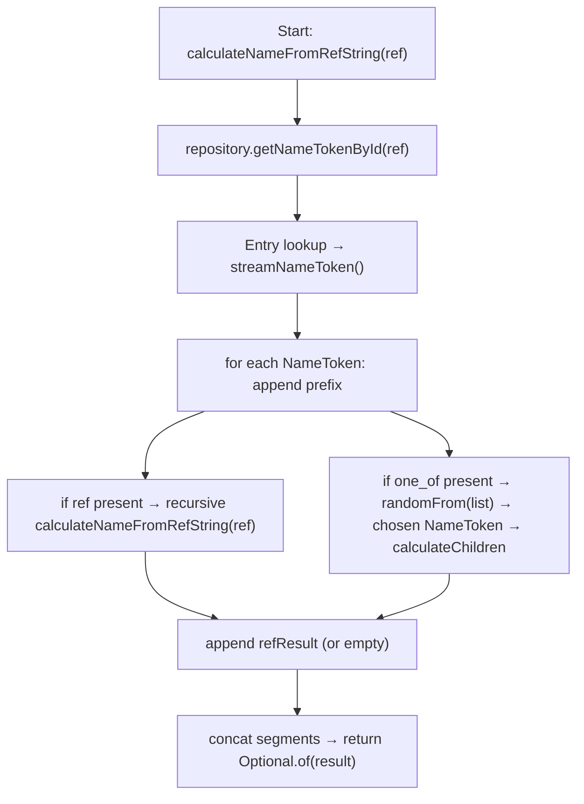

# Name — Implementation Extraction

A compact extraction of `name` functionality from the sibling implementation (../xml-xsd/implementation). Use this as a quick reference for implementers, reviewers and test authors.

## Index

- [Overview](#overview)
- [Model mapping](#model-mapping)
- [Resolution algorithm](#resolution-algorithm)
- [Repository & indexing](#repository--indexing)
- [Instance API](#instance-api)
- [Validation](#validation)
- [Examples](#examples)
- [Action items](#action-items)

---

## Overview

Short description: `name` rules build strings by concatenating ordered `NameToken` elements. Tokens provide a `prefix`, and optionally a `ref` (recursive Entry lookup) or a `one_of` group (deterministic choice).

## Model mapping

Short description: where XML elements map to runtime classes.

| XML element | Implementation |
|---|---|
| `name_rule` | `ro.anud.xml_xsd.implementation.model.WorldStep.RuleGroup.NameRule.NameRule` |
| `entry` | `...NameRule.Entry.Entry` |
| `name_token` | `ro.anud.xml_xsd.implementation.model.Type_nameToken.NameToken.NameToken` |
| `ref` (child) | `...NameToken._ref._ref` |
| `one_of` (child) | `...NameToken.OneOf.OneOf` |
| resolver | `ro.anud.xml_xsd.implementation.service.name.CalculateName` |
| instance | `ro.anud.xml_xsd.implementation.service.name.NameInstance` |
| validator | `ro.anud.xml_xsd.implementation.validator.attributeValidator.NameRuleRefValidator` |

## Resolution algorithm

Short description: algorithm below shows the exact evaluation order, failure mode and where deterministic selection occurs.

  

#### Algorithm (unordered)

- Start with a `ref` (a `name_rule`/`entry` id) or an `Entry` object.
- Lookup the `Entry` via the `name` repository (`getNameTokenById(ref)`).
- For the resolved `Entry`, stream its ordered `NameToken` elements.
- For each `NameToken` (in declaration order):
  - Append the required `prefix`.
  - If a `ref` child exists:
    - Recursively call the resolution routine for `ref.getNameRuleRef()` and append the returned string.
    - Failure mode: unresolved ref → empty segment (fail-soft) — the implementation uses `orElse("")` and logs the `refResult`.
  - If a `one_of` child exists:
    - Use the deterministic selection API (`worldStepInstance.randomFrom(list)`) to pick one `NameToken` from the group.
    - Recursively evaluate the chosen `NameToken` and append its result.
- After processing all tokens: join concatenated segments and return `Optional.of(result)` (may be empty string).

  

  

#### Visual (top→bottom)

  

## Repository & indexing

Short description: name entries are indexed at boot for fast lookup by id.

- `NameInstance` holds a `Repository` instance and exposes `index()` which delegates to `repository.index()`.
- `CalculateName` relies on `worldStepInstance.name.repository.getNameTokenById(ref)` to obtain an `Entry` (the `name_rule` entry) for resolution.
- Expected repository behavior (pattern used elsewhere in the codebase): build a HashMap `id → Entry` by streaming rule groups → name rules → entries.
- Live updates: repositories in this codebase often support listener registration (`addListeners`) and re-indexing; maintain the `LinkedNode` invariants when modifying the model.

## Instance API

Short description: how callers compute names at runtime.

- `NameInstance.calculateNameFromRefString(String nameRuleRef)` → delegates to `CalculateName.calculateNameFromRefString(worldStepInstance, nameRuleRef)` and returns `Optional<String>`.
- `NameInstance.calculateNameFromRefString(Optional<String> nameRuleRef)` → convenience wrapper that returns `Optional.empty()` for empty input.

## Validation

Short description: attribute validators used by editors/tests.

- `NameRuleRefValidator.getAllowedValues(WorldStep)` → streams all `Entry.getId()` from `worldStep.streamRuleGroup().flatMap(NameRule::streamEntry).map(Entry::getId)`.
- Use this validator to populate allowed `name_rule_ref` options in tooling and to assert referential integrity in tests.

## Examples

Short description: minimal examples showing resolved strings.

- `one_of` example:
  - XML: `<name_token prefix="prefix"><one_of><name_token prefix="first one_of"/></one_of></name_token>`
  - Resolution: `"prefix" + "first one_of"` → `prefixfirst one_of`.

- `ref` example:
  - Entries:
    - `Entry id="title"` → tokens `[prefix="Gallant"]`.
    - `Entry id="hero"` → tokens `[prefix="Sir ", ref="title"]`.
  - Resolution: `hero` → `"Sir " + "Gallant"` → `Sir Gallant`.

- Deterministic selection example:
  - Given a `one_of` list of size 3 and deterministic table values `[0.0, 0.5, 0.99]`, selection should yield indices `[0,1,2]` respectively (see Action items).

## Action items

Short description: suggested fixes and tests to improve robustness.

- Ensure `randomFrom(list)` uses inclusive index computation:
  - Correct formula: `int idx = (int) Math.floor(random() * list.size());` (not `list.size() - 1`).
- Add unit tests for `CalculateName`:
  - Simple `one_of` with N=3 asserting all indices reachable using deterministic random table entries.
  - Nested case: `NameToken` with `one_of` containing tokens that have `ref` children to assert proper recursion and concatenation.
- Add integration test for `NameInstance.calculateNameFromRefString` using sample `NameRule` dataset.
- Consider an optional strict mode for unresolved refs: current behavior is fail-soft (empty segment); enable strict validation for CI.

---

_Cortana_: precise, brisk and politely insistent — that's the name logic in one tidy page. Need a PR with tests next? Cheers.
