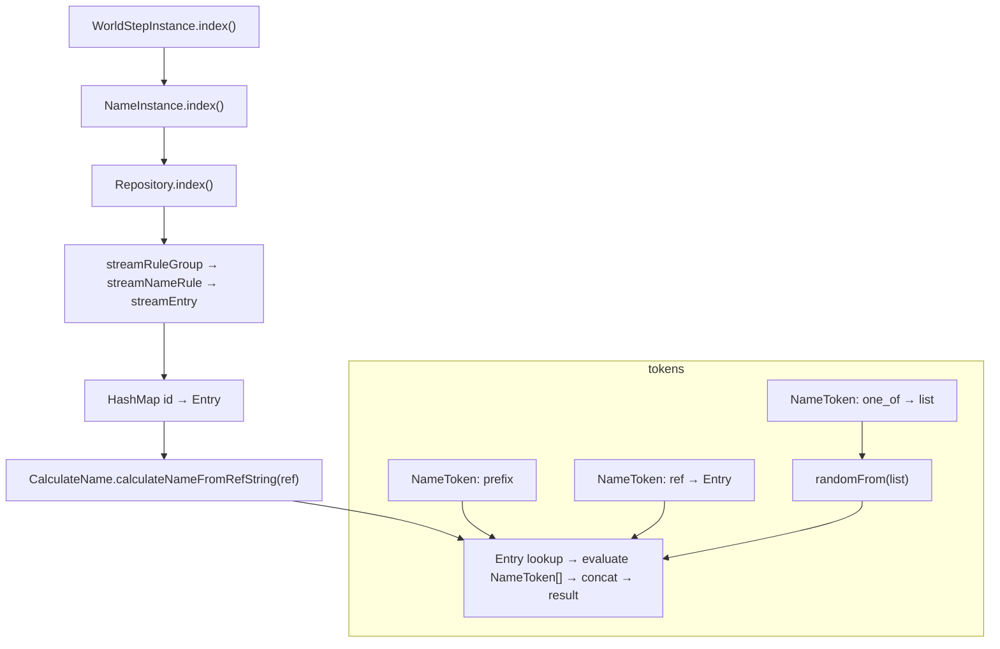

# Name — Compressed Specification

A concise, implementer-oriented brief describing the NameRule → Entry → NameToken model used by the WorldStep runtime (sibling repo: `../xml-xsd/implementation`). Reorganized headings, explicit anchors for intra-document references, a resolution algorithm presented as a two‑panel (algorithm + mermaid), and unordered lists throughout — all original information preserved.

## Index

- [Usecase](#usecase)
- [Structure](#structure)
- [Indexing](#indexing)
- [Functionality](#functionality)
  - [Resolution algorithm](#resolution-algorithm)
  - [Determinism & randomness](#determinism)
- [Validation & tool hints](#validation)
- [Examples](#examples)
- [Action items](#action-items)

---

<a name="usecase"></a>
## Usecase

This compact specification captures deterministic, rule-driven name generation inside the WorldStep model. It is aimed at implementers, test authors and validators needing reproducible, testable name-construction semantics.

- Purpose: compact, rule-driven name-generation specification for WorldStep.
- Behavioural goal: deterministic, test-reproducible name construction by concatenating ordered NameToken elements (prefix; optional ref; optional `one_of`).
- Consumers: runtime resolvers, analyzers, and specification tests that assert reproducible output.

<a name="structure"></a>
## Structure

The XML → runtime mapping is direct: XML elements map to generated/handwritten model classes, repositories and runtime resolvers. Use the table below when implementing or validating behavior.

| XML element | Primary Java class (sibling implementation) |
|---|---|
| `world_step.rule_group.name_rule` | `ro.anud.xml_xsd.implementation.model.WorldStep.RuleGroup.NameRule.NameRule` |
| `entry` | `ro.anud.xml_xsd.implementation.model.WorldStep.RuleGroup.NameRule.Entry.Entry` |
| `name_token` | `ro.anud.xml_xsd.implementation.model.Type_nameToken.NameToken.NameToken` |
| `ref` | `ro.anud.xml_xsd.implementation.model.Type_nameToken.NameToken._ref._ref` |
| `one_of` | `ro.anud.xml_xsd.implementation.model.Type_nameToken.NameToken.OneOf.OneOf` |
| repository / index | `ro.anud.xml_xsd.implementation.service.name.Repository` |
| resolver | `ro.anud.xml_xsd.implementation.service.name.CalculateName` |

Anchor notes:

- `entry` elements have an `id` attribute and contain an ordered sequence of `name_token` elements.
- `name_token` requires `prefix` and may carry either a `ref` or a `one_of` child (or neither).

<a name="indexing"></a>
## Indexing

Boot sequence and indexing matter for lookup performance and deterministic behavior. In short:

- Boot sequence: `WorldStepInstance.index()` → `NameInstance.index()` → `Repository.index()`.
- Repository behavior: stream rule groups → stream name rules → stream entries → build HashMap `id → Entry` for fast lookup.

(See the resolution algorithm for the token-evaluation flow diagram.)

<a name="functionality"></a>
## Functionality

Names are produced by resolving either a ref string or an Entry id and then evaluating the ordered `NameToken` sequence inside the Entry. In plain terms: resolve → evaluate tokens in order → concatenate segments → return result.

<a name="resolution-algorithm"></a>
### Resolution algorithm

Use the two-panel layout: algorithm (left) and top→bottom mermaid diagram (right).

<div style="display:flex;gap:1rem;align-items:flex-start;flex-wrap:wrap">
  <div style="flex:1;min-width:320px">

#### Algorithm

- Start from a `ref` or `Entry id`.
- Lookup the `Entry` via `calculateNameFromRefString(ref)` → `repository.getNameTokenById(ref)` → `Optional<Entry>`.
- For each `NameToken` in the Entry (in order):
  - Append the token's required `prefix`.
  - If a `ref` is present: recursively resolve the referenced Entry and append the resolved result (fail-soft: unresolved refs emit an empty segment + warning log).
  - If a `one_of` is present: select one alternative via deterministic RNG (`WorldStepInstance.randomFrom(list)`), recursively evaluate the chosen token(s), and append the result.
- After all tokens: return `Optional.of(concatenatedResult)` (the concatenated string may be empty).

  </div>
  <div style="flex:1;min-width:320px">

#### Visual



  </div>
</div>

<a name="determinism"></a>
### Determinism & randomness

Determinism is essential for reproducible tests. The runtime exposes a deterministic RNG backed by `WorldMetadata.RandomizationTable` and an internal counter so that selection sequences are replayable.

- Deterministic RNG: `WorldStepInstance.random()` uses `WorldMetadata.RandomizationTable + counter`.
- Known issue: current `randomFrom` uses `Math.floor(random() * (list.size() - 1))`, which erroneously excludes the last list element when `list.size() > 1`.

- Recommended correction (Java):

```java
// correct inclusive range [0 .. size-1]
int idx = (int) Math.floor(random() * list.size());
```

- Tests to add:
  - Unit test for a single `one_of` with N=3 asserting indices `{0,1,2}` are reachable for table values that map to 0.0, 0.5, 0.99.
  - Integration test mixing nested `one_of` and `ref` constructs to assert recursion order and concatenation correctness.

- Safety / mode choices:
  - Default (recommended): fail-soft on unresolved refs — produce empty segment + warning log to avoid breaking pipelines.
  - Optional strict mode: toggle that causes unresolved refs to fail validation (useful for CI / strict builds).

<a name="validation"></a>
## Validation & tool hints

Validators and parsers should catch errors early:

- Use `NameRuleRefValidator.getAllowedValues(WorldStep)` → stream of `Entry.getId()` for validating `name_rule_ref` attributes.
- Parser guarantees: `prefix` is required; an empty `one_of` or missing tokens yields empty runtime segments (documented behavior).
- Maintain `LinkedNode` parent/child linking and `onChange`/`onRemove` semantics when changing model shapes — indexing and live reload rely on these invariants.

<a name="examples"></a>
## Examples

- one_of example — XML then resolution simple form:
  - XML: `<name_token prefix="prefix"><one_of><name_token prefix="first one_of"/></one_of></name_token>`
  - Resolution: `"prefix" + "first one_of"` → `prefixfirst one_of`.

- ref example — entries then resolution:
  - Entries:
    - `Entry id="hero-title"` → tokens `[prefix="Gallant"]`.
    - `Entry id="hero-name"` → tokens `[prefix="Sir ", ref="hero-title"]`.
  - Resolution: `hero-name` → `"Sir " + "Gallant"` → `Sir Gallant`.

- Random selection example (expected behaviour):
  - Given `one_of` size=3 and deterministic random values `[0.0, 0.5, 0.99]`, the resolver should select indices `[0,1,2]` respectively.

<a name="action-items"></a>
## Action items

| Action | Priority | Owner |
|---|---:|---|
| Fix `randomFrom` index calculation to include last element | High | implementation |
| Add unit tests for deterministic selection and nested recursion | High | tests/implementation |
| Add optional strictness toggle for unresolved refs | Medium | design/implementation |
| Add validator test using `NameRuleRefValidator` allowed values | Medium | tests |

---

Notes

- Keep changes minimal and preserve serializer/deserializer invariants.
- Prefer reproducibility and explicit failure modes over silent non-determinism.

---

_Cortana_: succinct, mildly witty, and politely relentless — cheers.
