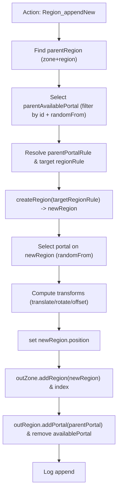

# Zones & Regions — Extracted Functionalities (implementation)

A concise extraction of zones and regions behavior from the sibling implementation (../xml-xsd/implementation). Aimed at implementers, reviewers and test authors who need a compact reference.

## Index

- [Overview](#overview)
- [Model mapping](#model-mapping)
- [Repositories & indexing](#repositories-and-indexing)
- [Runtime behaviours](#runtime-behaviours)
  - [Zone creation](#zone-creation)
  - [Region creation & append](#region-creation-and-append)
  - [Entity teleportation](#entity-teleportation)
- [Region append algorithm (two-panel)](#region-append-algorithm)
- [Utilities & implementation notes](#utilities)
- [Examples](#examples)
- [Action items](#action-items)

---

## Overview

Zones group Regions; Regions contain Entities and Portals. The implementation exposes service-level instances, repositories, and middleware actions to create, index, append and move these objects during runtime.

## Model mapping

| Concept | Primary implementation class |
|---|---|
| Zone data element | `ro.anud.xml_xsd.implementation.model.WorldStep.Data.ZoneList.Zone.Zone` |
| Region data element | `ro.anud.xml_xsd.implementation.model.WorldStep.Data.ZoneList.Zone.Region.Region` |
| ZoneRule / Entry | `ro.anud.xml_xsd.implementation.model.WorldStep.RuleGroup.ZoneRule.ZoneRule` / `...ZoneRule.Entry.Entry` |
| RegionRule / Entry | `ro.anud.xml_xsd.implementation.model.WorldStep.RuleGroup.RegionRule.RegionRule` / `...RegionRule.Entry.Entry` |
| Zone service instance | `ro.anud.xml_xsd.implementation.service.zone.ZoneInstance` |
| Zone repository | `...service.zone.ZoneRepository` |
| Zone region index | `...service.zone.ZoneRegionRepository` |
| Zone entity index | `...service.zone.ZoneEntityRepository` |
| Region service instance | `ro.anud.xml_xsd.implementation.service.region.RegionInstance` |
| Region repository | `...service.region.RegionRepository` |
| Zone/Region rule repos | `ro.anud.xml_xsd.implementation.repository.ZoneRuleRepository` / `RegionRuleRepository` |

Notes:

- Anchor points are provided above for quick navigation.
- The service layer composes repositories into instances (e.g., ZoneInstance contains repository, entities, region).

## Repositories & indexing

- ZoneInstance.index()
  - calls `repository.index(data)` where `data = worldStepInstance.streamWorldStep().flatMap(WorldStep::streamData).toList()`
  - then calls `entities.index()` and `region.index()`.
- ZoneRepository
  - maintains `HashMap<String, Zone> idZoneMap` populated by streaming Data → ZoneList → Zone.
  - provides `findById(String id)` and `addIfNotExist(Zone)` which appends new zones into the first ZoneList (via `streamDataOrDefault` / `streamZoneListOrDefault`).
- ZoneRegionRepository
  - uses `NullableIndex` keyed on `Region::getId` and `reIndex` on the list of regions (collected by streaming Zone → Region).
  - has `addIfNotExist(Region)` which ensures the parent Zone is present (calls `zone.repository.addIfNotExist(parentZone)`).
  - `loadData()` registers listeners for live updates.
- ZoneEntityRepository
  - exposes `byZoneIdAndByEntityIdRef` composite index (zone→region→entity) for fast lookups and updates.
- RegionRepository
  - builds a `Map<zoneId, Map<regionId, Region>>` for zone+region lookups. Provides `findByZoneIdAndRegionId`.
- Rule repositories (ZoneRuleRepository, RegionRuleRepository)
  - index ruleGroups → zone/region rules → entries; provide getById(id) for rule lookup used at runtime.

## Runtime behaviours

### Zone creation

- Trigger: `Zone_create` actions processed by `ZoneCreateAction.zoneCreateAction`.
- Behavior:
  - Resolve `zoneRuleRef` via `ruleRepository.zoneRule.getById(...)`.
  - In the *out* instance, append a new Zone with `id = worldStepInstance.getNextId()`.
  - The Zone's initial `region` list contains a starting Region produced by `region.createStartingRegion(zoneRule)`.
  - Action nodes are removed from the source WorldStep after processing.

### Region creation & append

- Region creation (RegionInstance.createRegion):
  - Produces a Region from a region-rule Entry.
  - Assigns a generated id (`getNextId()`), sets rule reference, computes limits and position via `computeOperation(...)` on rule expressions, and builds `availablePortals` if the rule defines portals.
- Region append (RegionInstance.appendTo):
  - Given a parent Region and a `portalIdRef`, the code:
    - Finds the parent available portal (filter by id and select using `randomFrom(...)`).
    - Resolves the parent portal rule and the target region rule (via portal rule `to.region` references).
    - Creates the new Region via `createRegion(newRegionRule)`.
    - Picks a portal on the new region rule for the destination side (again `randomFrom(...)`).
    - Computes geometrical transforms (origin translation, bounding-box offsets, rotation, portal offsets) using helper methods: `translateOrigin`, `translateAwayBoundingBox`, `translateAvailablePortalOffset`, `rotateTargetPosition`, `translateDestinationPortal`, `translateToBoundingBox`.
    - Sets `newRegion.position` accordingly and appends the new Region to the out-instance zone and region indices.
    - Adds a portal mapping on the parent/out region (`outRegion.getPortalsOrDefault().addPortal(...)`) and removes the used available portal entry.

### Entity teleportation

- Trigger: `Region_teleportEntity` actions processed by `ZoneTeleportEntity.zoneTeleportEntity`.
- Behavior:
  - Resolve entity via `worldStepInstance.zone.entities.byZoneIdAndByEntityIdRef` or create a placeholder entity with the referenced id.
  - Set entity `position` from the action coordinates.
  - In the out-instance: remove the entity from any previous parent, ensure target region exists (via `zone.region.addIfNotExist(outRegion)`), and append the entity to `outRegion.getEntityListOrDefault().addEntity(entity)`.
  - Remove action nodes after processing.

### Region append algorithm (two-panel)

  

#### Algorithm (unordered)

- Receive `parentRegion` and `portalIdRef`.
- Lookup parent zone and parent region rule.
- Select the matching parent available portal (filter by `portalIdRef` then `randomFrom(list)`).
- Resolve parent portal rule and the `to.region` rule target.
- Create `newRegion` from the resolved target region rule.
- Select a portal on `newRegion` to link back (via `randomFrom`).
- Compute portal widths and positions; perform transforms:
  - translate origin
  - translate away bounding box
  - apply available-portal offset
  - rotate target position
  - translate destination portal
  - translate to bounding box
- Set `newRegion.position`.
- Append `newRegion` to out-zone and index it in region repository.
- Add portal mapping to out-region and remove used available-portal entry.
- Log and return.

  

  

#### Visual (mermaid)

  

## Utilities & implementation notes

- Deterministic selection: `worldStepInstance.randomFrom(list)` is used to pick among portals/choices; ensure inclusive index computation (see action items).
- ID management: `worldStepInstance.getNextId()` produces generated ids for new Zones/Regions/Portals.
- Computations: `worldStepInstance.computeOperation(expression)` is used to evaluate numeric expressions in rules (e.g., portal start offsets, limits).
- Index helpers: `NullableIndex` and `NonNullableIndex` compose fast multi-key indices and support `reIndex` and `addListeners(worldStepInstance)` for live updates.
- Live updates: `loadData()` registers repository listeners to support runtime changes.

## Examples

- Zone create example (simplified):
  - Action contains `zoneRuleRef` → `ZoneCreateAction` finds the zone rule, calls `region.createStartingRegion(zoneRule)` → adds new Zone to out world with generated id and starting region.

- Region append example (conceptual):
  - `Region_appendNew(zoneIdRef, regionIdRef, portalIdRef)` → `RegionInstance.appendTo(parentRegion, portalIdRef)` → new region created and placed adjacent via computed transforms.

## Action items

- Add unit tests for `RegionInstance.appendTo` to verify portal selection and coordinate transforms in a deterministic manner.
- Ensure `randomFrom` index computation is inclusive (`floor(random() * size)`) so last element is selectable.
- Add integration tests for `ZoneCreateAction` + `RegionInstance.createStartingRegion` to validate rule-based region initialization.
- Document `NullableIndex` composition patterns for future contributors.

---

_Cortana_: practical, brisk and mildly encouraging — you now have a compact map of zones & regions from implementation. Shall we wire tests next? Cheers.
